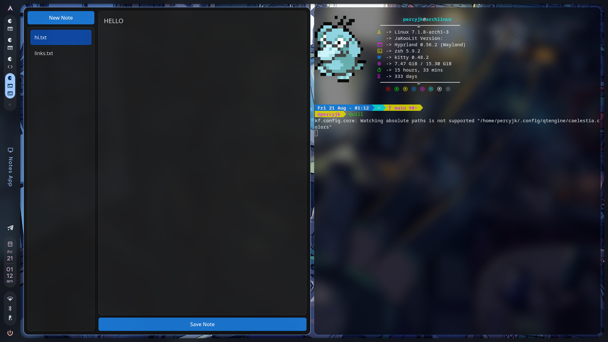

# Quill

A simple and lightweight note-taking application built with **Python** and **PySide6**.


## Installation

Prerequisites:
- Python 3.10 or newer installed
- PySide6 installed

```bash
git clone https://github.com/DevBarik731/Quill.git
cd Quill
python quill.py
```
## Screenshot



### Linux
If you are using Linux, you can run:

```bash
chmod +x install.sh
./install.sh
```

This will install Quill as a terminal command, allowing you to launch the application from anywhere using:

```bash
quill
```
